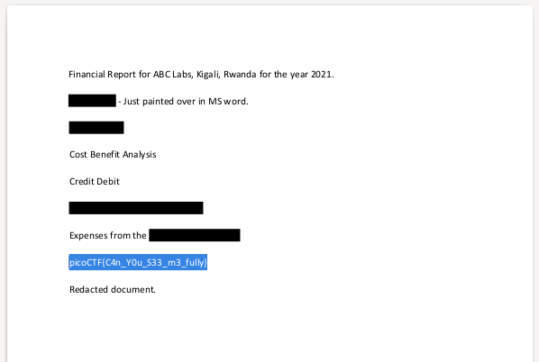

# Redaction gone wrong
### Description
> Now you DON’T see me. This report has some critical data in it, some of which have been redacted correctly, while some were not. Can you find an important key that was not redacted properly?

### Solution
Then you download the file from Description, you can get `"Financial_Report_for_ABC_Labs.pdf"` that is `.pdf` format.
```
$ file Financial_Report_for_ABC_Labs.pdf
Financial_Report_for_ABC_Labs.pdf: PDF document, version 1.7
```
Then you open the file by `evince` etc, you can find part coated black in the file.


Then you drag part coated black by mouse, you can find hidden strings in this part.


Therefore, flag is `picoCTF{C4n_Y0u_S33_m3_fully}`.