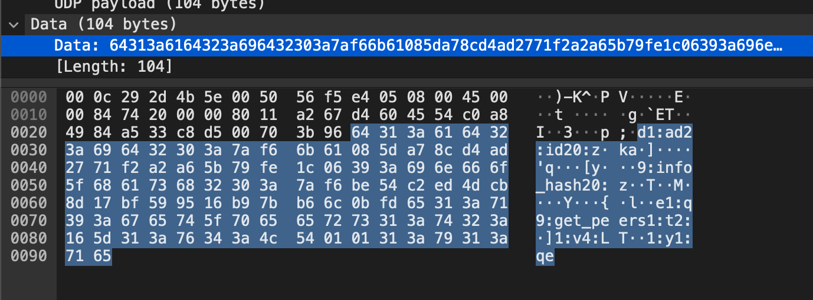

# Torrent Analyze

### Description
> SOS, someone is torrenting on our network.
> One of your colleagues has been using torrent to download some files on the company’s network.
> Can you identify the file(s) that were downloaded? The file name will be the flag, like picoCTF{filename}.

### Solution
The file has a Hash.
Base on Hash, you find the specific file.

Load the packet file(`torrent.pcap`) into WireShark.
And, search the strings. (Ctrl+F)

If you type `hash`, you can find `info_hash` strings, and copy the Data.

```
64313a6164323a696432303a7af66b61085da78cd4ad2771f2a2a65b79fe1c06393a696e666f5f6861736832303a7af6be54c2ed4dcb8d17bf599516b97bb66c0bfd65313a71393a6765745f7065657273313a74323a165d313a76343a4c540101313a79313a7165
```



And, Take out only the necessary parts.

```
e2467cbf021192c241367b892230dc1e05c0580e
```

This is the Hash, so google it.

https://linuxtracker.org/index.php?page=torrent-details&id=e2467cbf021192c241367b892230dc1e05c0580e

The flag is `picoCTF{ubuntu-19.10-desktop-amd64.iso}`

### Writer
[yu1hpa](https://twitter.com/yu1hpa)

