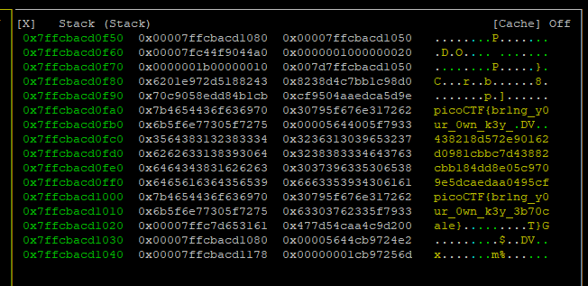

# Keygenme
### Description
> Can you get the flag? Reverse engineer this binary.

### Solution
Then you download the file from Description, you can get `"keygenme"` that is `ELF 64-bit` format.
```
keygenme: ELF 64-bit LSB shared object, x86-64, version 1 (SYSV), dynamically linked, interpreter /lib64/ld-linux-x86-64.so.2, BuildID[sha1]=a09e4fc7c07ca1590b0b85604175bea555b4955a, for GNU/Linux 3.2.0, stripped
```

The you give execute permission to the file and execute the file, you find that to input license key is required. So, you can find that you can get flag by getting correct license key.
```
$ ./keygenme
Enter your license key: aaaa
That key is invalid.
```

You do reverse assembly of `main()` function by using `radare2` etc.
```
[0x00001120]> s main
[0x0000148b]> pdf
            ; DATA XREF from entry0 @ 0x1141
┌ 144: int main (int argc, char **argv);
│           ; var char **var_40h @ rbp-0x40
│           ; var int64_t var_34h @ rbp-0x34
│           ; var char *s @ rbp-0x30
│           ; var int64_t canary @ rbp-0x8
│           ; arg int argc @ rdi
│           ; arg char **argv @ rsi
│           0x0000148b      f30f1efa       endbr64
│           0x0000148f      55             push rbp
│           0x00001490      4889e5         mov rbp, rsp
│           0x00001493      4883ec40       sub rsp, 0x40
│           0x00001497      897dcc         mov dword [var_34h], edi    ; argc
│           0x0000149a      488975c0       mov qword [var_40h], rsi    ; argv
│           0x0000149e      64488b042528.  mov rax, qword fs:[0x28]
│           0x000014a7      488945f8       mov qword [canary], rax
│           0x000014ab      31c0           xor eax, eax
│           0x000014ad      488d3d550b00.  lea rdi, str.Enter_your_license_key:_ ; 0x2009 ; "Enter your license key: " ; const char *format
│           0x000014b4      b800000000     mov eax, 0
│           0x000014b9      e8f2fbffff     call sym.imp.printf         ; int printf(const char *format)
│           0x000014be      488b154b2b00.  mov rdx, qword [obj.stdin]  ; [0x4010:8]=0 ; FILE *stream
│           0x000014c5      488d45d0       lea rax, [s]
│           0x000014c9      be25000000     mov esi, 0x25               ; '%' ; int size
│           0x000014ce      4889c7         mov rdi, rax                ; char *s
│           0x000014d1      e8fafbffff     call sym.imp.fgets          ; char *fgets(char *s, int size, FILE *stream)
│           0x000014d6      488d45d0       lea rax, [s]
│           0x000014da      4889c7         mov rdi, rax                ; char *arg1
│           0x000014dd      e827fdffff     call fcn.00001209
│           0x000014e2      84c0           test al, al
│       ┌─< 0x000014e4      740e           je 0x14f4
│       │   0x000014e6      488d3d350b00.  lea rdi, str.That_key_is_valid. ; 0x2022 ; "That key is valid." ; const char *s
│       │   0x000014ed      e8cefbffff     call sym.imp.puts           ; int puts(const char *s)
│      ┌──< 0x000014f2      eb0c           jmp 0x1500
│      ││   ; CODE XREF from main @ 0x14e4
│      │└─> 0x000014f4      488d3d3a0b00.  lea rdi, str.That_key_is_invalid. ; 0x2035 ; "That key is invalid." ; const char *s
│      │    0x000014fb      e8c0fbffff     call sym.imp.puts           ; int puts(const char *s)
│      │    ; CODE XREF from main @ 0x14f2
│      └──> 0x00001500      b800000000     mov eax, 0
│           0x00001505      488b4df8       mov rcx, qword [canary]
│           0x00001509      6448330c2528.  xor rcx, qword fs:[0x28]
│       ┌─< 0x00001512      7405           je 0x1519
│       │   0x00001514      e8f7fbffff     call sym.imp.__stack_chk_fail ; void __stack_chk_fail(void)
│       │   ; CODE XREF from main @ 0x1512
│       └─> 0x00001519      c9             leave
└           0x0000151a      c3             ret
```

From the disassembler, you can be read that input license key is stored to `[var_30h] = $rbp-0x30` and `fcn.00001209` is set the license key as argument and be called.
So, you do reverse assembly of `fcn.00001209`.
```
[0x0000148b]> s fcn.00001209
[0x00001209]> pdf
            ; CALL XREF from main @ 0x14dd
┌ 642: fcn.00001209 (char *arg1);
　...
│           0x00001209      f30f1efa       endbr64
│           0x0000120d      55             push rbp
│           0x0000120e      4889e5         mov rbp, rsp
│           0x00001211      4881ece00000.  sub rsp, 0xe0
│           0x00001218      4889bd28ffff.  mov qword [var_d8h], rdi    ; arg1
│           0x0000121f      64488b042528.  mov rax, qword fs:[0x28]
│           0x00001228      488945f8       mov qword [canary], rax
│           0x0000122c      31c0           xor eax, eax
│           0x0000122e      48b87069636f.  movabs rax, 0x7b4654436f636970 ; 'picoCTF{'
│           0x00001238      48ba6272316e.  movabs rdx, 0x30795f676e317262 ; 'br1ng_y0'
│           0x00001242      48898570ffff.  mov qword [s], rax
│           0x00001249      48899578ffff.  mov qword [var_88h], rdx
│           0x00001250      48b875725f30.  movabs rax, 0x6b5f6e77305f7275 ; 'ur_0wn_k'
│           0x0000125a      48894580       mov qword [var_80h], rax
│           0x0000125e      c7458833795f.  mov dword [var_78h], 0x5f7933 ; '3y_'
│           0x00001265      66c7854effff.  mov word [var_b2h], 0x7d    ; '}'
│           0x0000126e      488d8570ffff.  lea rax, [s]
│           0x00001275      4889c7         mov rdi, rax                ; const char *s
│           0x00001278      e863feffff     call sym.imp.strlen         ; size_t strlen(const char *s)
│           0x0000127d      4889c1         mov rcx, rax
 ...
│           0x00001479      644833342528.  xor rsi, qword fs:[0x28]
│       ┌─< 0x00001482      7405           je 0x1489
│       │   0x00001484      e887fcffff     call sym.imp.__stack_chk_fail ; void __stack_chk_fail(void)
│       │   ; CODE XREF from fcn.00001209 @ 0x1482
│       └─> 0x00001489      c9             leave
└           0x0000148a      c3             ret
```

In result of the disassembly, because you can find part of flag like `"picoCTF{"`, you can infer that you can find flag in this function.
You do decompile by using `ghidra`.
```c++
undefined8 FUN_00101209(char *param_1)

{
  size_t sVar1;
  undefined8 uVar2;
  long in_FS_OFFSET;
  int local_d0;
  int local_cc;
  int local_c8;
  int local_c4;
  int local_c0;
  undefined2 local_ba;
  byte local_b8 [16];
  byte local_a8 [16];
  undefined8 local_98;
  undefined8 local_90;
  undefined8 local_88;
  undefined4 local_80;
  char local_78 [10];
  undefined local_6e;
  undefined local_6c;
  undefined local_6b;
  undefined local_62;
  undefined local_60;
  undefined local_5f;
  char local_58 [21];
  undefined local_43;
  char acStack56 [40];
  long local_10;
  
  local_10 = *(long *)(in_FS_OFFSET + 0x28);
  local_98 = 0x7b4654436f636970;
  local_90 = 0x30795f676e317262;
  local_88 = 0x6b5f6e77305f7275;
  local_80 = 0x5f7933;
  local_ba = 0x7d;
  sVar1 = strlen((char *)&local_98);
  MD5((uchar *)&local_98,sVar1,local_b8);
  sVar1 = strlen((char *)&local_ba);
  MD5((uchar *)&local_ba,sVar1,local_a8);
  local_d0 = 0;
  for (local_cc = 0; local_cc < 0x10; local_cc = local_cc + 1) {
    sprintf(local_78 + local_d0,"%02x",(ulong)local_b8[local_cc]);
    local_d0 = local_d0 + 2;
  }
  local_d0 = 0;
  for (local_c8 = 0; local_c8 < 0x10; local_c8 = local_c8 + 1) {
    sprintf(local_58 + local_d0,"%02x",(ulong)local_a8[local_c8]);
    local_d0 = local_d0 + 2;
  }
  for (local_c4 = 0; local_c4 < 0x1b; local_c4 = local_c4 + 1) {
    acStack56[local_c4] = *(char *)((long)&local_98 + (long)local_c4);
  }
  acStack56[27] = local_78[1];
  acStack56[28] = local_62;
  acStack56[29] = local_5f;
  acStack56[30] = local_6c;
  acStack56[31] = local_60;
  acStack56[32] = local_43;
  acStack56[33] = local_6b;
  acStack56[34] = local_6e;
  acStack56[35] = (undefined)local_ba;
  sVar1 = strlen(param_1);
  if (sVar1 == 0x24) {
    for (local_c0 = 0; local_c0 < 0x24; local_c0 = local_c0 + 1) {
      if (param_1[local_c0] != acStack56[local_c0]) {
        uVar2 = 0;
        goto LAB_00101475;
      }
    }
    uVar2 = 1;
  }
  else {
    uVar2 = 0;
  }
LAB_00101475:
  if (local_10 != *(long *)(in_FS_OFFSET + 0x28)) {
                    /* WARNING: Subroutine does not return */
    __stack_chk_fail();
  }
  return uVar2;
}
```

From result of decompile. you can find that the program hash string which is part of flag by MD5, and make string by connection these characters.
Also, you can find that the program compare inputted license key and string that is made by above operation.
Therefore, you can find that string that is made in this function is correct license key.
For the reason `acStack56`, which store correct license key, is local variable, you can find correct license key by observing stack's state of this function's range.
You observe stack's state of this function's range by using `radare2` etc.


Therefore, you can find that correct license key is `picoCTF{br1ng_y0ur_0wn_k3y_3b70ca1e}`. 
Then you execute the file and input it, you can find that the license key is correct.
```
$ ./keygenme
Enter your license key: picoCTF{br1ng_y0ur_0wn_k3y_3b70ca1e}
That key is valid.
```

Therefore, flag is `picoCTF{br1ng_y0ur_0wn_k3y_3b70ca1e}`.

### Writer
Yajirushi